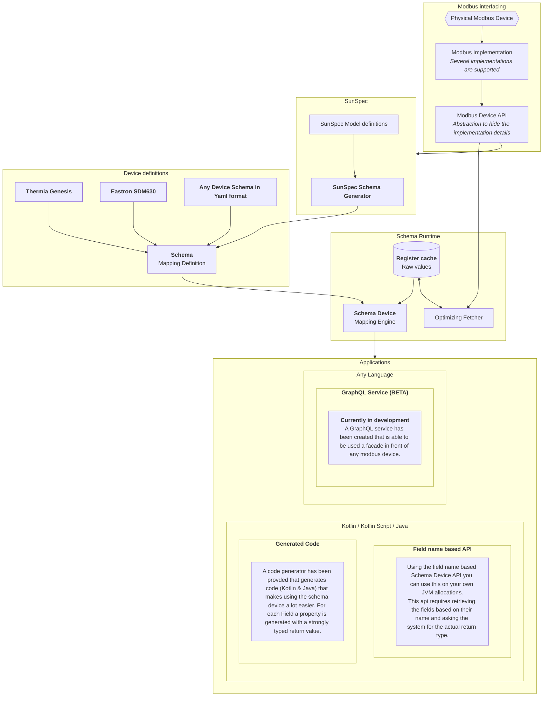

+++
title = "The Modbus Schema Toolkit"
type = "home"
+++

## Summary

This is a Kotlin/Java toolkit that combines the ability to make a generic modbus mapping with an advanced modbus query
optimizer.
The goal of this set of libraries and tools to make getting meaningful data from Modbus devices like Electricity Meters,
Solar Inverters and Heat pumps very easy and very efficient.

This toolkit mainly consist of the following components:

- A generic definition language for creating a modbus mapping (a Modbus Schema).
    - i.e. translate binary values to meaningful values
- A Kotlin/Java 11 (JVM only) library that uses this mapping definition to optimize the retrieval of the underlying data
  and provide the desired meaningful values.
- A collection ready to run schemas (all the devices I have...):
    - Eastron SDM 630 Electricity Meter
    - Thermia Genesis Heatpump
    - SunSpec compliant devices.

{}
The way the mapping is defined is an open format and can be reimplemented into any programming language by anyone.
{}

{}
This toolkit relies on existing libraries to do the actually Modbus data transfer.
Connectors to multiple modbus implementations have been included.
{}

{}
I have this running in a very simple [Kotlin Script](/usage/kotlinscript) on a Raspberry PI 3 (yes, that old).
It fetches the data, converts it into useful values and puts these into a time series database every second.
{}

## Main differences

The main features that the existing Modbus libraries (I have found) not have:

- A generic way of mapping registers to values which allows for the kind of expressions you see in SunSpec.
    - Most libraries only return the binary values, some allow basic single value mapping (like Apache Plc4x).
- Full support for SunSpec using the official SunSpec definitions.
- An optimizer that
    - automatically calculates the minimal number of modbus requests for the collection of Fields (= meaningful value)
    - automatically optimizes around read errors
    - automatically skips the Fields that have been retrieved and do not need to be retrieved again (immutable/read
      error)
- A maven plugin to convert a Modbus Schema into code.
    - The intent is for it to be possible into any language, Kotlin and Java have been included.

## Known limitations/Problems/Bugs

Things I will **NOT** change/fix:

- **It is READ ONLY. So NO writing.**
    - I will not change that because I consider that too much of a risk.

Things I intend to build/fix:

- Support for Coils and Discrete Inputs (Only Registers right now).

## Overall status

Works on my machines. Usable for experiments.

## Overview

## Github projects

I have split this into 4 projects:

- [Modbus Schema](https://github.com/nielsbasjes/modbus-schema):
    - The main toolkit and schema definition
    - 
      
      
      
      
- [Modbus Devices](https://github.com/nielsbasjes/modbus-devices):
    - The actual schemas of a few devices.
    - 
      
      
      
      
- [SunSpec Device](https://github.com/nielsbasjes/sunspec-device):
    - Generate the Modbus Schema for the specific SunSpec you have
    - 
      
      
      
      
- [Modbus GraphQL](https://github.com/nielsbasjes/modbus-graphql):
    - Wrap any Modbus Schema and serve a device over GraphQL
    - 
      
      
      
- [Modbus Website](https://github.com/nielsbasjes/modbus-website):
    - The source code of this website

All of this was created by [Niels Basjes](https://niels.basjes.nl/).
