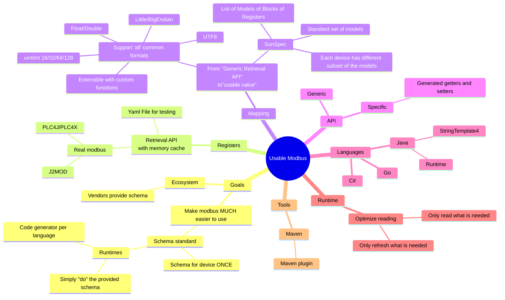
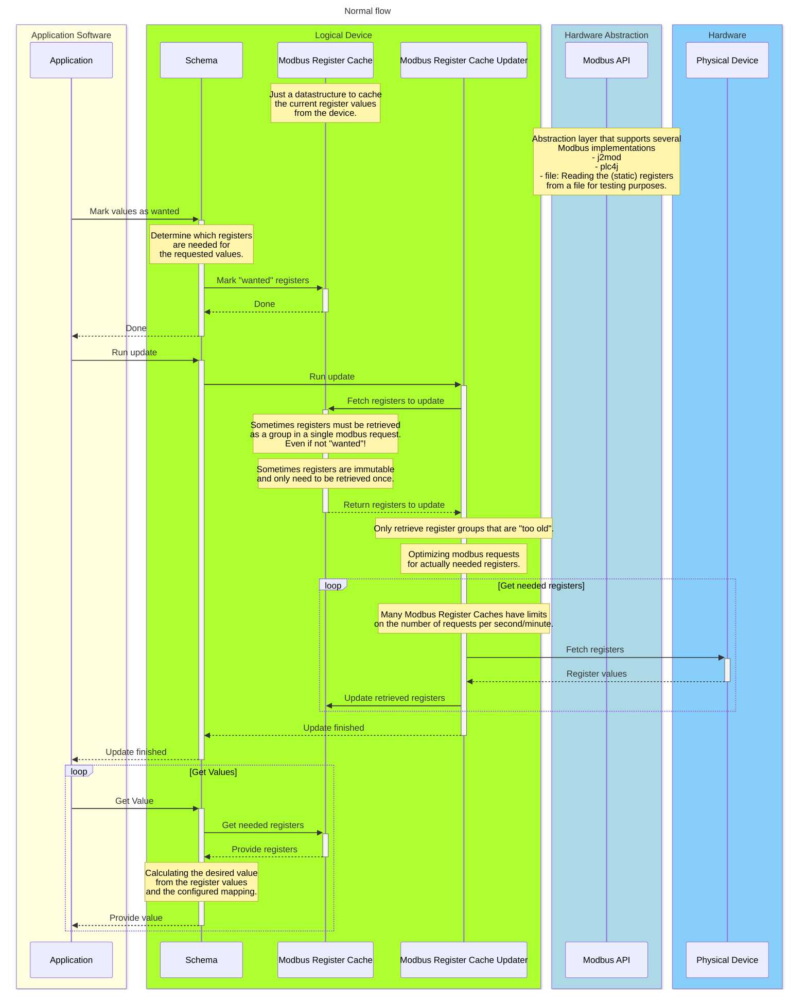
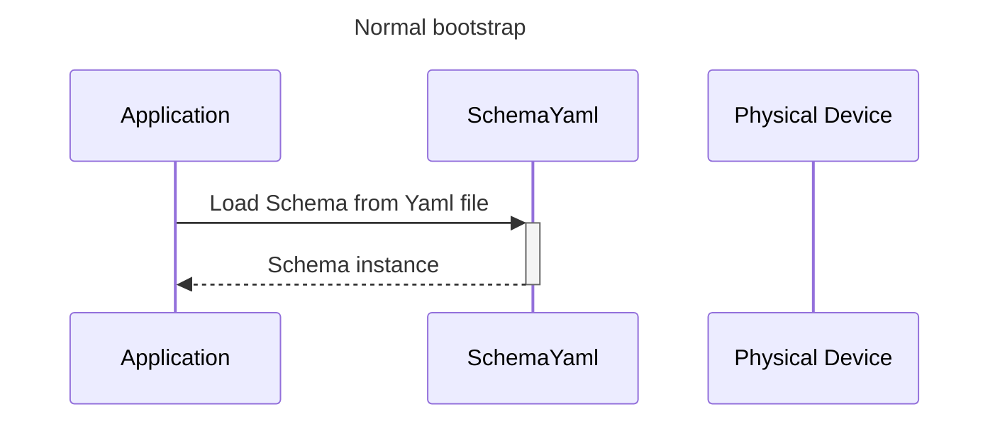
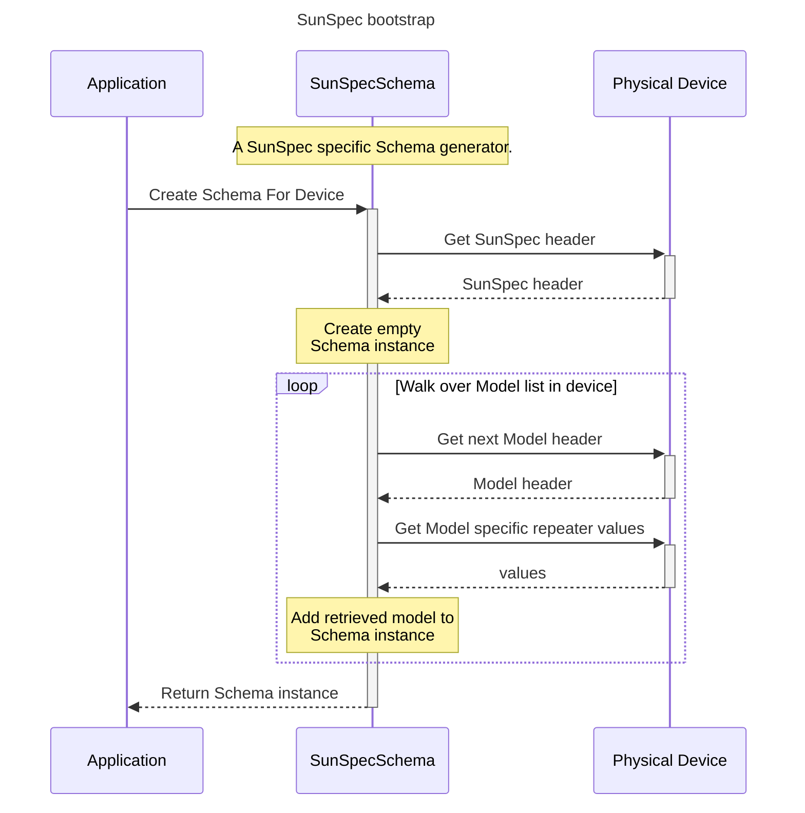
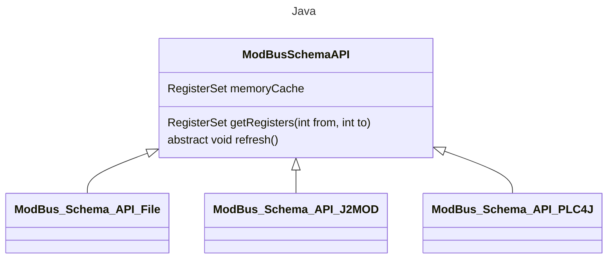

+++
title = 'Design'
weight = 60
+++

{}
My original design sketches from a few years ago (~2023). Looking back a lot has worked out already.
{}

:

Java
===
* Read and parse the schema into memory structure
    * Usable by StringTemplate4 to generate Java code
    * Convertable into in memory runtime model

Layers
- Outside:
    - Schema specific Getters
        - Generated by StringTemplate4 based on the schema
    - GraphQL (subscriptions!) API
        - GraphQL Schema and code dynamically constructed
            - Based on the device schema
- Generic name based getters
    - Generated at startup using the device schema
    - Dynamically created expression evaluation structure
        - Uses other Generic name based getters
        - Uses Modbus Registers
- Retrieval layer
    - Cache of all registers
        - Current value
        - Last retrieval timestamp
    - Grouping of the registers
        - Which MUST be retrieved in a single request
        - Which must be updated
            - Needed?
            - Immutable?
                - Already have a value?
    - Retrieval
        - Optimizer
            - Of all registers that must be updated
                - Which are combined to reduce the number of modbus requests.
                - Maximum number of registers per request !!
            - Create retrieval sets of registers
        - Use existing tooling (like plc4j and j2mod) to actually GET the values

